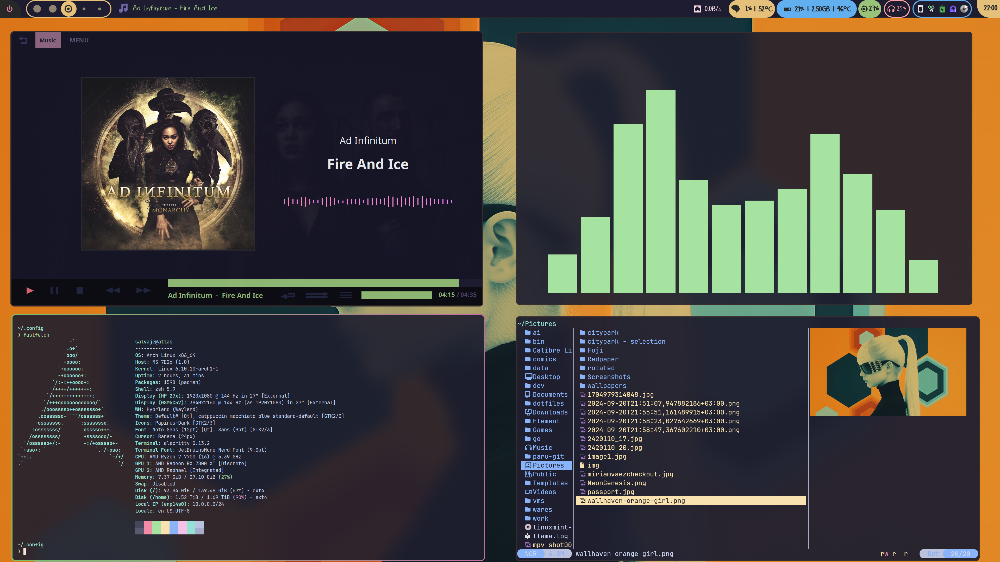
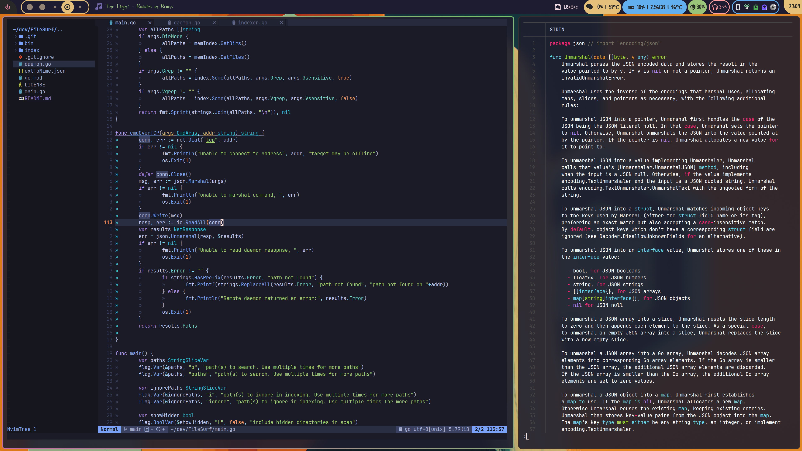

# Dotfiles
## About
This repo contains my most frequently used config files. If you use the same programs as I do
then they may be useful to you. Please make sure you read through the config files to know if
they will be useful to you and what you may want to change.

**Colorful Theme Hyprland**

**Colorful Theme Hyprland Desktop**

**Colorful Theme BSPWM**

## Prerequisites
Before you attempt to install these dots, you must first make sure your system is ready. Otherwise
they may not work as intended.

#### Fonts
For a basic install, you will need to have [Powerline](https://github.com/powerline/powerline) and [Font Awesome](https://github.com/FortAwesome/Font-Awesome) which will work fine for most of the
symbols to be visible. There are however, some widgets in polybar that will not load properly
and I would highly recommend getting the [Nerd Fonts](https://github.com/ryanoasis/nerd-fonts) and Noto Fonts packages. For polybar specifically, the necessary
fonts are `UbuntuMono Nerd` and `Noto Fonts Symbols`. These can be installed individually or as part of the previously
mentioned packages.
Terminals use `JetBrainsMono Nerd` so make sure that is also installed.

#### Colors
Colors are not that important to get right and you can go with whatever color scheme you wish. To manage
and control colors I use a [Pywal (Archved)](https://github.com/dylanaraps/pywal). This program can be used to generate colors schemes and palettes which can 
the be integrated into other programs like terminals and Polybar. It is not a must you use it, but if you
want a consistent color scheme throughout your setup, it is recommended to use it.

#### Zsh
I have here, but keep in mind that the screenshots you see are all with Zsh. The outcome will therefor not look exactly the same.
For my Zsh install I used to use [Oh-My-Zsh](https://github.com/ohmyzsh/ohmyzsh) to manage my configuration. I now just use my own dots since they are now mature and do everything I want them to. Visit their Wiki to find out how to use it.
I use [Starship](https://starship.rs/) for the prompt with basically no modifications. The default works fine for me and is easy to re-deploy on other machines. 

#### Polybar
I only use polybar BSPWM. I have not used BSPWM in over a year two years, but if you choose to use my polybar configs, you can find them in my [Carousel Repo](https://github.com/keystroke3/Carousel)

#### Waybar
Since I use Hyprland, I use [Waybar](https://github.com/Alexays/Waybar) instead of Polybar. The font I am using is a paid font called Miriam Vaez, so I can't share freely. 

#### NeoVim

I use [KickStart.nvim](https://github.com/nvim-lua/kickstart.nvim) with [my fork](https://github.com/keystroke3/kickstart.nvim). I don't use the nvim configs here and I can't be bothered to remove them.

#### Wallpaper
The full resolution wallapper by Alx can be found on [wallhaven](https://wallhaven.cc/w/1pzdvw). I stretched it a bit since it looked a bit squished despite being very high resolution.

## Apps
I will try to list all the things I use here, but I can't grantee that the list is up to date or that it includes everything. These are the ones I interact with on a daily basis

- Os
     - Arch Linux
- WM
    - Hyprland
    - Waybar
    - Fuzzel (rofi alternative for wayland)
    - wlogout
    - [Hyprman](https://github.com/keystroke3/hyprman) (work in progress)
    - Thunar
    - [FileSurf](https://github.com/keystroke3/FileSurf) (better for piping into things)
    - Hyprpicker
    - Grimblast with satty (flameshot alternative)

- Misc
    - Alacritty
    - Kitty
    - KDE Connect
    - Yazi (TUI file manager)
    - Firefox
    - Fzf (for my fuzzy finding needs)
    - Copyq
    - Easyeffects
    - Solarr
    - Thunderbird
    - NeoVim
    - VSCode
    - [Tauon](https://tauonmusicbox.rocks/)

## Installation
If you have all things set up correctly, you can start copying the files. First, clone the repo:  
`git clone https://github.com/keystroke3/dotfiles.git`  
After cloning, you can copy the files to their respective locations and then logout and log back in to apply changes.

