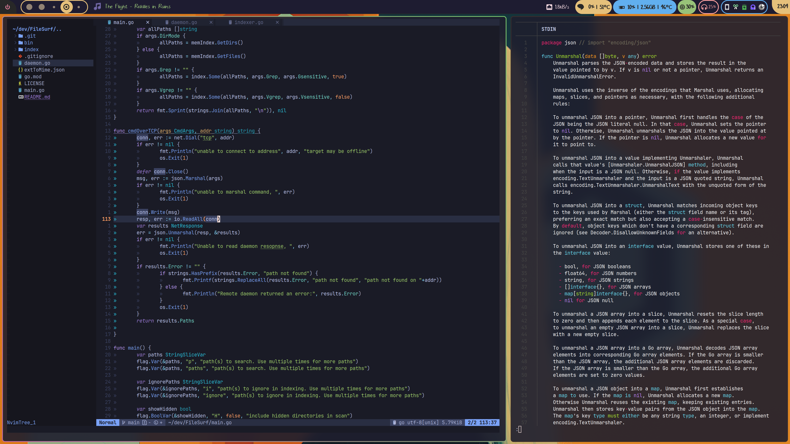

# Dotfiles
## About
This repo contains my most frequently used config files. If you use the same programs as I do
then they may be useful to you. Please make sure you read through the config files to know if
they will be useful to you and what you may want to change.

The screenshots above are from an older Hyprland/BSPWM setup — I've since moved to niri. New
screenshots are on the TODO list.

## Prerequisites
Before you attempt to install these dots, you must first make sure your system is ready. Otherwise
they may not work as intended.

#### Fonts
For a basic install, you will need to have [Powerline](https://github.com/powerline/powerline) and [Font Awesome](https://github.com/FortAwesome/Font-Awesome) which will work fine for most of the
symbols to be visible. There are however, some widgets that will not load properly
and I would highly recommend getting the [Nerd Fonts](https://github.com/ryanoasis/nerd-fonts) and Noto Fonts packages.
Terminals use `JetBrainsMono Nerd` so make sure that is also installed.

#### Fish
Fish is now my primary shell. My old Zsh config is still in the repo (I used
[Oh-My-Zsh](https://github.com/ohmyzsh/ohmyzsh) once, then my own dots) but is legacy at this
point — treat it as reference, not the maintained path.

#### Niri
On Linux I run [niri](https://github.com/YaLTeR/niri), a scrollable-tiling Wayland compositor. I no longer
use Hyprland or BSPWM, and their configs (along with polybar/waybar-only tooling) are stale
leftovers in this repo.

#### Noctalia
The shell/bar for niri is [Noctalia](https://github.com/noctalia-dev/noctalia-shell) (a Quickshell
config), launched via `qs -c noctalia-shell`. It replaces what used to be Waybar.

#### NeoVim
I use [KickStart.nvim](https://github.com/nvim-lua/kickstart.nvim) with [my fork](https://github.com/keystroke3/kickstart.nvim). I don't use the plain `vim`/`ranger`/`lf` configs here and I can't be bothered to remove them.

#### Wallpaper
The full resolution wallapper by Alx can be found on [wallhaven](https://wallhaven.cc/w/1pzdvw). I stretched it a bit since it looked a bit squished despite being very high resolution.

## Apps
I will try to list all the things I use here, but I can't grantee that the list is up to date or that it includes everything. These are the ones I interact with on a daily basis.

- Arch Linux / niri
    - niri
    - [Noctalia](https://github.com/noctalia-dev/noctalia-shell) (bar/shell)
    - wlogout
    - Hyprpicker (color picker)
    - swww (wallpaper daemon)
    - LibreWolf
    - Thunar
    - KDE Connect
    - Copyq
    - [Tauon](https://tauonmusicbox.rocks/) music player

- macOS
    - Firefox
    - [kanata](https://github.com/jtroo/kanata) (keyboard remapping, driver-only — replaced Karabiner-Elements)
    - [Amethyst](https://github.com/ianyh/Amethyst) (autotiling)
    - Vorssaint (bar utils, editable screenshots)
    - Maccy (clipboard manager)

- Misc (both)
    - Ghostty (terminal)
    - Alacritty
    - Kitty
    - Yazi (TUI file manager)
    - Fzf (for my fuzzy finding needs)
    - mpv
    - [Census](https://github.com/keystroke3/census) I have renamed the binary to `fs` and is being used in the various scripts
    - NeoVim
    - VSCodium
    - opencode
    - GitHub CLI (`gh`)
    - lazygit
    - herdr

## Installation
If you have all things set up correctly, you can start copying the files. First, clone the repo:  
`git clone https://github.com/keystroke3/dotfiles.git`  
After cloning, you can copy the files to their respective locations and then logout and log back in to apply changes.
